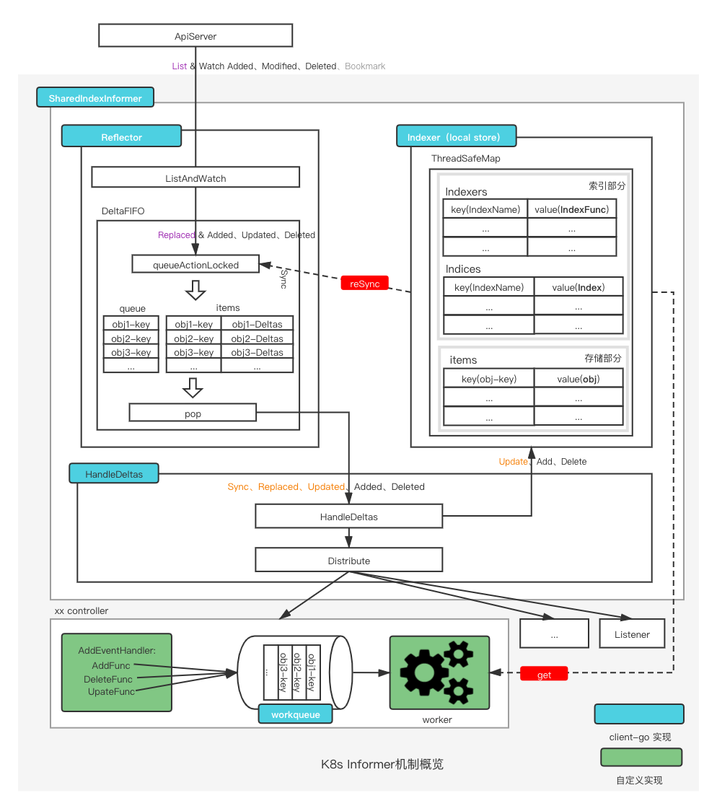

# 初识Informer

## 调度器中的Informer

`Informer`是`Kubernetes`中最重要的机制之一，在前面我们了解过`kube-scheduler`的代码，现在可以简单回顾，在其中找到`Informer`的影子。

`cmd/kube-scheduler/app/server.go`文件中的`Run`函数完成了调度器实例的启动，看一下其中的`Informer`使用

```Go
startInformersAndWaitForSync := func(ctx context.Context) {
  // Start all informers.
  cc.InformerFactory.Start(ctx.Done())
  // DynInformerFactory can be nil in tests.
  if cc.DynInformerFactory != nil {
    cc.DynInformerFactory.Start(ctx.Done())
  }

  // Wait for all caches to sync before scheduling.
  cc.InformerFactory.WaitForCacheSync(ctx.Done())
  // DynInformerFactory can be nil in tests.
  if cc.DynInformerFactory != nil {
    cc.DynInformerFactory.WaitForCacheSync(ctx.Done())
  }

  // Wait for all handlers to sync (all items in the initial list delivered) before scheduling.
  if err := sched.WaitForHandlersSync(ctx); err != nil {
    logger.Error(err, "waiting for handlers to sync")
  }

  close(handlerSyncReadyCh)
  logger.V(3).Info("Handlers synced")
}

if !cc.ComponentConfig.DelayCacheUntilActive || cc.LeaderElection == nil {
  startInformersAndWaitForSync(ctx)
}
```

其中的`InformerFactory`往前找来自于`cmd/kube-scheduler/app/options/options.go`中的`Config`方法

```Go
c.InformerFactory = scheduler.NewInformerFactory(client, 0)
```

其中`scheduler.NewInformerFactory`的作用就是创建了一个`PodInformer`

```Go
func NewInformerFactory(cs clientset.Interface, resyncPeriod time.Duration) informers.SharedInformerFactory {
    informerFactory := informers.NewSharedInformerFactory(cs, resyncPeriod)
    informerFactory.InformerFor(&v1.Pod{}, newPodInformer)
    return informerFactory
}
```

在`pkg/scheduler/scheduler.go`的`New`函数中，创建了两个`Lister`。通过代码可以看出，创建`Lister`会使用到`Informer`的`Indexer`，从而间接创建`Informer`。

```Go
podLister := informerFactory.Core().V1().Pods().Lister()
nodeLister := informerFactory.Core().V1().Nodes().Lister()

func (f *nodeInformer) Informer() cache.SharedIndexInformer {
    return f.factory.InformerFor(&apicorev1.Node{}, f.defaultInformer)
}

func (f *nodeInformer) Lister() corev1.NodeLister {
    return corev1.NewNodeLister(f.Informer().GetIndexer())
}
```

以及注册了所有的事件处理方法

```Go
if err = addAllEventHandlers(sched, informerFactory, dynInformerFactory, resourceClaimCache, unionedGVKs(queueingHintsPerProfile)); err != nil {
  return nil, fmt.Errorf("adding event handlers: %w", err)
}

func addAllEventHandlers(
    sched *Scheduler,
    informerFactory informers.SharedInformerFactory,
    dynInformerFactory dynamicinformer.DynamicSharedInformerFactory,
    resourceClaimCache *assumecache.AssumeCache,
    gvkMap map[framework.EventResource]framework.ActionType,
) error {
    var (
        handlerRegistration cache.ResourceEventHandlerRegistration
        err                 error
        handlers            []cache.ResourceEventHandlerRegistration
    )
    // scheduled pod cache
    if handlerRegistration, err = informerFactory.Core().V1().Pods().Informer().AddEventHandler(
        cache.FilteringResourceEventHandler{
            FilterFunc: func(obj interface{}) bool {
                switch t := obj.(type) {
                case *v1.Pod:
                    return assignedPod(t)
                case cache.DeletedFinalStateUnknown:
                    if _, ok := t.Obj.(*v1.Pod); ok {
                        / The carried object may be stale, so we don't use it to check if
                        // it's assigned or not. Attempting to cleanup anyways.
                        return true
                    }
                    utilruntime.HandleError(fmt.Errorf("unable to convert object %T to *v1.Pod in %T", obj, sched))
                    return false
                default:
                    utilruntime.HandleError(fmt.Errorf("unable to handle object in %T: %T", sched, obj))
                    return false
                }
            },
            Handler: cache.ResourceEventHandlerFuncs{
                AddFunc:    sched.addPodToCache,
                UpdateFunc: sched.updatePodInCache,
                DeleteFunc: sched.deletePodFromCache,
            },
        },
    ); err != nil {
        return err
    }
    handlers = append(handlers, handlerRegistration)
    ......
}
```

下面重新按照正序梳理一遍：首先我们在生成`Config`对象时创建了一个`Informer`工厂，创建了`PodInformer`、`PodLister`和`NodeLister`，然后在`Run`时启动了工厂中的所有`Informer`并注册了相应的事件处理方法。

## Informer概述

在Kubernetes中的资源都是以一个`API对象`的形式存在`etcd`中的，对于各种控制器(不仅限于控制器)而言，如果要通过调谐来使资源的状态趋于期望状态`Expect`的前提是能够获取资源对象的`增/删/改`事件，而获取资源对象变化事件就是通过`Informer`机制来实现的。

如果是初学者，大都是在学习Pod创建过程时第一次听到`Informer/ListAndWatch`这两个词，下面就来正式认识什么是`Informer`。

如果用一句话来说明`Informer`机制的作用，那么获取资源对象的实时变化再合适不过了，但是其中还有很多的设计和实现细节，在后面都会慢慢了解到。



整体的设计架构如上图，首先从图中可以看到`Informer`的具体对象类型是`SharedIndexInformer`，然后在源码中搜索该类型，可以知道所有的实现都在`staging/src/k8s.io/client-go/tools/cache/`中，`Reflector`、`DeltaFIFO`和`Indexer`的同名文件也都在这个目录下可以找到。

## 组件介绍

### Reflector

直接对接`Api Server`来监控资源变化，当资源对象发生变化时，触发对应事件并将其放入`DeltaFIFO`中，最为重要的`ListAndWatch`就是在`Reflector`中实现的。

### DeltaFIFO

其中的资源对象为`Delta`，每个`Delta`包括它的资源对象和事件类型，从名字也可以看出是存放着`Delta`的先入先出队列。

### Indexer

所有API对象的本地存储，通过`DeltaFIFO`中的`Delta`更新自身状态，是在本地上资源对象最新状态的数据来源。

### Listener

在处理`DeltaFIFO`中事件时，会把对应事件分发给`Listener`，`Informer`与`Listener`是一对多的关系。

### WorkQueue

工作队列的实现其实并不和`Informer`在一起，甚至不属于`Informer`的组件，但是由于`Informer`机制和工作队列紧密相关，`Listener`感受到资源对象的事件后，会将对应`obj`的key放入工作队列，然后由`Worker`消费。

## 数据结构

以`SharedInformer`为入口开始分析`Informer`的工作流程